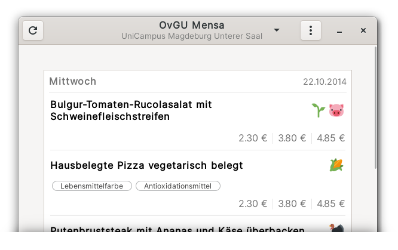

<h1 align="center">Welcome to OvGU Mensa 🥗</h1>

<p align="center">
  <br>
  <a href="https://github.com/fin-ger/gnome-ovgu-canteen/actions?query=workflow%3A%22master%22">
    
  </a>
  <a href="https://github.com/fin-ger/gnome-ovgu-canteen/actions?query=workflow%3A%22release%22">
    
  </a>
  <a href="https://github.com/fin-ger/gnome-ovgu-canteen/releases">
    
  </a>
  <a href="https://github.com/fin-ger/gnome-ovgu-canteen/blob/master/LICENSE">
    
  </a>
  <a href="https://github.com/fin-ger/gnome-ovgu-canteen">
    
  </a>
  <a href="http://spacemacs.org">
    
  </a>
  <a href="http://makeapullrequest.com">
    
  </a>
  <br>
  <i>Display the <a href="https://www.studentenwerk-magdeburg.de/mensen-cafeterien/mensa-unicampus/">OvGU canteen menu</a> in a small Gnome application</i>
  <br><br>
  <a href="#installation">Installation</a> •
  <a href="#translating">Translating</a> •
  <a href="#building-the-project">Building the Project</a> •
  <a href="#troubleshooting">Troubleshooting</a> •
  <a href="#authors">Authors</a>
</p>

---

This app displays the canteens of the Studentenwerk Magdeburg, including UniCampus, Kellercafé Zschokestraße, Herrenkrug, Stendal, Wernigerode, and DomCafete Halberstadt.

## Installation

> TODO

<!--
<p align="center">
  <a href="https://flathub.org/apps/details/de.fin_ger.OvGUCanteen"></a>
  &emsp;
  <a href="https://snapcraft.io/gnome-ovgu-canteen"></a>
</p>
-->

<p align="center">
  The easiest way to install is by installing this App via one of the above App Stores.
<p>

## Translating

In order to translate this extension you first need to install [`Poedit`](https://poedit.net/). You may use your distributions package manager to install it.

When finished, [fork](https://help.github.com/en/github/getting-started-with-github/fork-a-repo) this project and clone like described in the linked guide.

### Creating a new translation

Open Poedit and select `File` / `New From POT/PO File...` and select `gnome-ovgu-canteen/po/template.pot`. Select the language you want to translate to. Now start translating.

### Edit or update an existing translation

Open Poedit and select `Open`. Navigate to the `gnome-ovgu-canteen/po` folder and select the language file (`.po`) you want to edit/update. Now select `Catalog` / `Update from POT File...` and select `gnome-ovgu-canteen/po/template.pot`. Now, you can start updating the translation.

### Saving your work

When finished save the file into the `po` folder and [push](https://help.github.com/en/github/managing-files-in-a-repository/adding-a-file-to-a-repository-using-the-command-line) your changes to your fork. Now, you can create a [pull request](https://help.github.com/en/github/collaborating-with-issues-and-pull-requests/creating-a-pull-request) to make your translation available in the main OvGU Mensa installation.

## Building the Project

Instead of installing via an app store, you can build the project yourself from source. First, you have to setup a Gnome development environment.

### Ubuntu and Debian

```
$ sudo apt-get install build-essential libgtk-3-dev
```

### Fedora

```
$ sudo dnf install @development-tools gettext-devel openssl-devel gtk3-devel
```

### Arch

```
$ sudo pacman -Syy gnome-common base-devel intltool
```

### Gentoo

You are good-to-go with the `default/linux/amd64/17.0/desktop/gnome/systemd` profile or similar.

View your current profile with:

```
# eselect profile list
```

---

Next, you need to setup a Rust toolchain. I recommend using [`rustup`](https://rustup.rs/). When the latest Rust stable toolchain is successfully installed, you can clone the project:

```
$ git clone https://github.com/fin-ger/gnome-ovgu-canteen.git
$ cd gnome-ovgu-canteen
```

### Build the project

```
$ make build
```

### Install your custom build

```
$ make install PREFIX=/usr/local
```

The program will be installed to `/usr/local/bin/gnome-ovgu-canteen` as well as icons, desktop files, gsettings schemas, and localization files.

### Running the application for development

If `~/.local/bin` is in your `PATH` you can use\

```
$ make run
```

to build and run the application.

## Troubleshooting

If you find any bugs/unexpected behaviour or you have a proposition for future changes open an issue describing the current behaviour and what you expected.

## Authors

**Fin Christensen**

> [:octocat: `@fin-ger`](https://github.com/fin-ger)  
> [:elephant: `@fin_ger@weirder.earth`](https://weirder.earth/@fin_ger)  
> [:bird: `@fin_ger_github`](https://twitter.com/fin_ger_github)  

**Johannes Wünsche**

> [:octocat: `@jwuensche`](https://github.com/jwuensche)  
> [:elephant: `@fredowald@mastodon.social`](https://mastodon.social/web/accounts/843376)  
> [:bird: `@Fredowald`](https://twitter.com/fredowald)  

## Show your support

Give a :star: if this project helped you!
