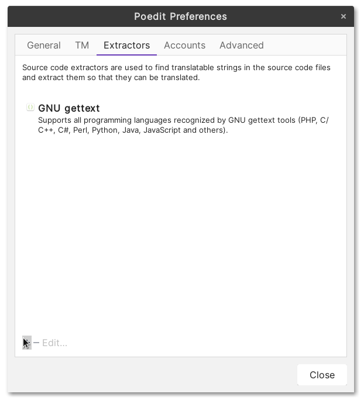
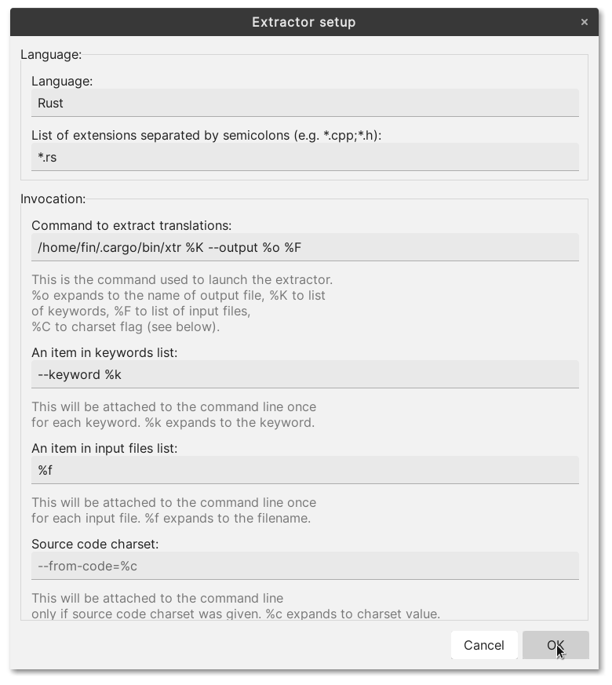
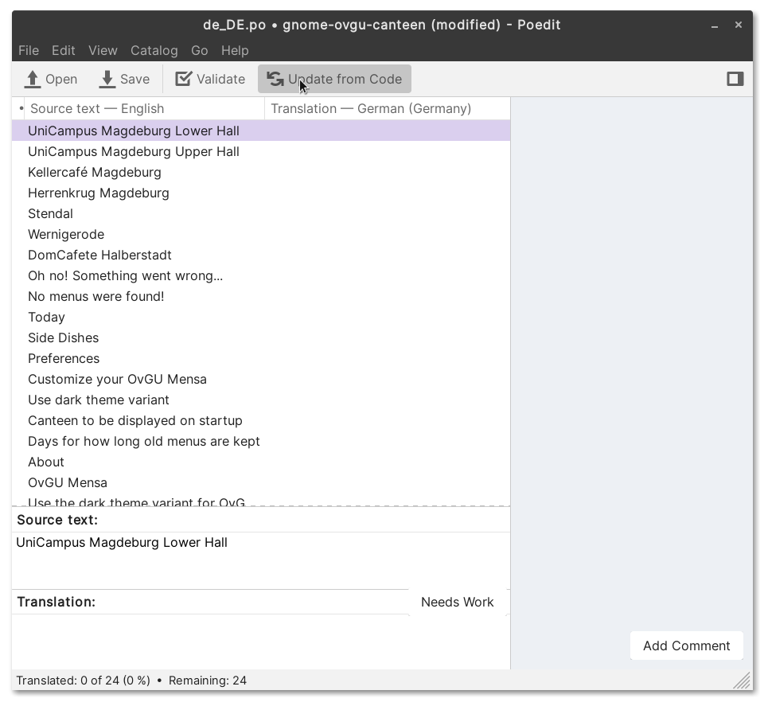

# Translating

## Updating translations with Poedit

> Note: this is only needed if you are a maintainer of this project. If you are a translator please use the provided `template.pot`

First you have to install `xtr`, a tool similar to `xgettext` but for rust sources:

```
$ cargo install xtr
```

Now, we have to tell Poedit how to use `xtr`. Open the preferences of Poedit and switch to the `Extractors` tab:



Click on the `+` button and enter the following information:



Please make sure to enter the correct path to `xtr`.

You can now use `Update from Code` from within Poedit!


